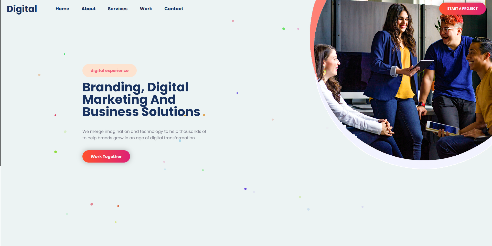
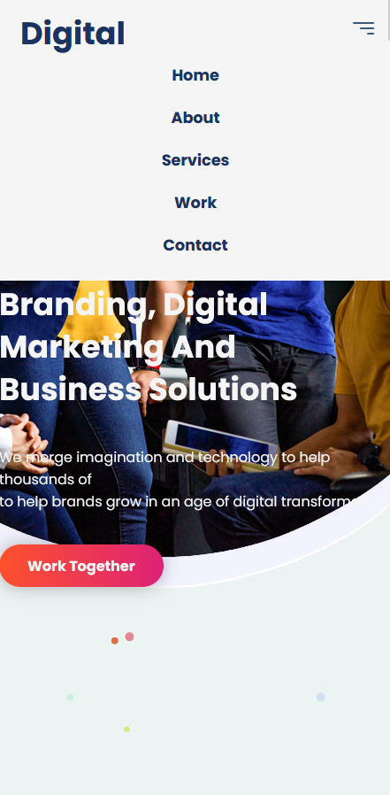

# Table of content:

* About project.
* Screenshots.
* Methodologies.
* Languages.
* External libraries.
* Things I Learned.
* Fixes.

## About Project:

    This is clone of a website from daily Tution youtube channel. A step by step follow up to improve my skills on HTML, CSS, Javascript and Animation through the use of external libraries and CSS libraries.

## Screenshots:

* ScreenShot for desktop view.

* ScreenShot for mobile view

* ScreeenShot with mobile menu active.

**Screenshots**

## **Methodologies:**

In this project I inaugurated the use of HTML, CSS and Javascript as well as other external libraries for animations. I also made use of utility classes i made from the tutorial to help imrove the speed of my developement.

## Langusges:

* HTML
* CSS
* Javascript.

## External Libraries:

* Masonry JS
* Rellax JS
* Animate on Scroll(AOS)

## Things I learned:

* Making and using re-usable classes for the project.
* Advance grid sytem for placing items in a particular grid section.
* Intigrating external libraries for effects and animations.
* Making proper use of git and making arious commits to track the various stages of the project.

## Fixes:

In my clone, I fixed the buttons in the banner section and also added some colum-gap to the mobile version of the article section.
